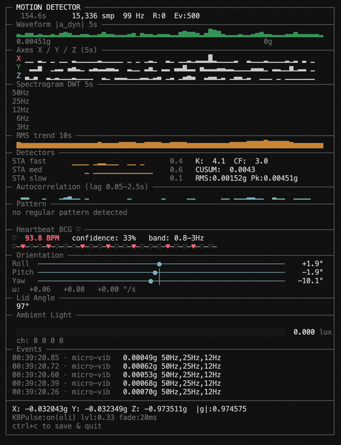

# apple-silicon-accelerometer

通过 IOKit HID（SPU / AppleSPUHIDDevice）读取 Apple Silicon MacBook Pro 内置的未公开加速度计和陀螺仪数据，以及屏幕开合角度和环境光传感器。

更多信息：[阅读原文](https://medium.com/@oli.bourbonnais/your-macbook-has-an-accelerometer-and-you-can-read-it-in-real-time-in-python-28d9395fb180)

## 这是什么

Apple Silicon MacBook 内置了一颗难以找到的 MEMS IMU（加速度计 + 陀螺仪），由传感器处理单元（SPU）管理，未通过任何公开 API 或框架暴露。

本项目通过 IOKit HID 回调，读取原始三轴加速度（加速度计）和三轴角速度（陀螺仪）数据。

目前仅在 MacBook Pro M3 上完成测试。

## 工作原理

传感器位于 IOKit 注册表中 `AppleSPUHIDDevice` 之下，使用厂商用途页 `0xFF00`。
- 用途 3：加速度计
- 用途 9：陀螺仪（同一物理 IMU，根据拆机分析推测为 Bosch BMI286）

驱动为 `AppleSPUHIDDriver`，属于传感器处理单元的一部分。
通过 `IOHIDDeviceCreate` 打开设备，并用 `IOHIDDeviceRegisterInputReportCallback` 注册异步回调。
数据以 22 字节 HID 报告形式传来，X/Y/Z 值为 int32 小端序，分别位于字节偏移 6、10、14。
除以 65536 即可得到以 g（加速度）或 °/s（陀螺仪）为单位的值。
回调频率约 100Hz（从约 800Hz 原生频率降采样）。

姿态方向通过 Mahony AHRS 四元数滤波器融合加速度计和陀螺仪数据计算得出，以滚转/俯仰/偏航仪表盘形式显示。

可以用以下命令确认设备是否存在于你的机器上：

    ioreg -l -w0 | grep -A5 AppleSPUHIDDevice

## 快速上手

    git clone https://github.com/olvvier/apple-silicon-accelerometer
    cd apple-silicon-accelerometer
    pip install -e .
    sudo python3 motion_live.py

需要 root 权限，因为 Apple Silicon 上访问 IOKit HID 设备需要提权。

### 键盘背光闪烁模式（内置 KBPulse）

`motion_live.py` 可根据振动强度近实时地闪烁键盘背光。
仓库内已包含 KBPulse，预编译的 Apple Silicon 二进制文件位于 `KBPulse/bin/KBPulse`。

正常运行：

    sudo python3 motion_live.py

可选参数：

    sudo python3 motion_live.py --no-kbpulse
    sudo python3 motion_live.py --kbpulse-bin /path/to/KBPulse

### 使用 uv

如果已安装 `uv`/`uvx`，也可以直接运行：

    sudo uvx git+https://github.com/olvvier/apple-silicon-accelerometer.git

## 代码结构

- `spu_sensor.py` — 核心模块：IOKit 绑定、设备发现、加速度计 + 陀螺仪 + 屏幕角度 + 环境光 HID 回调、共享内存环形缓冲区
- `motion_live.py` — 振动检测流水线、心跳 BCG、终端仪表盘 UI、主循环
- `KBPulse/` — 键盘背光驱动代码及二进制文件（`KBPulse/bin/KBPulse`）

传感器读取逻辑封装在 `spu_sensor.py` 中，可单独复用。

## 心跳演示

将手腕搭在笔记本键盘附近（靠近触控板），等待 10-20 秒信号稳定。
这里使用的是心冲击描记术（BCG）——心跳产生的机械振动经手臂传入笔记本底盘。
属于实验性功能，不够稳定，只是展示传感器能捕捉什么的有趣用例。
BCG 带通滤波器频段为 0.8-3Hz，BPM 通过对滤波信号做自相关估算得出。

## 注意事项

- 实验性 / 未公开的 AppleSPU HID 路径
- 需要 sudo
- 未来的 macOS 更新可能导致失效
- 风险自负
- 不得用于医疗用途

## 不支持的机型

- Intel MacBook（M1 之前的机型）
- M1 MacBook Air/Pro（2020 年款）

## 致谢

本项目基于 [olvvier/apple-silicon-accelerometer](https://github.com/olvvier/apple-silicon-accelerometer) 开发，感谢原作者 [@olvvier](https://github.com/olvvier) 发现并公开了 Apple Silicon MacBook 上未文档化的 SPU 传感器访问方式。

## 许可证

MIT

---

与 Apple 及任何雇主无关联
